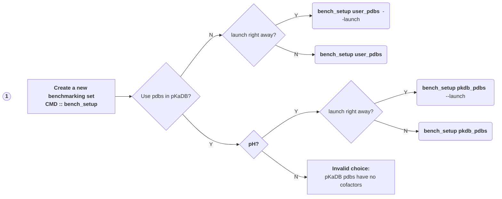
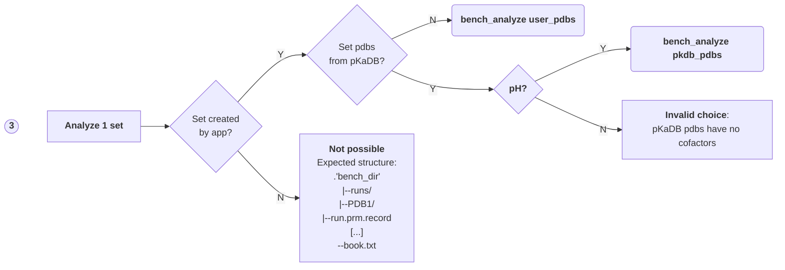
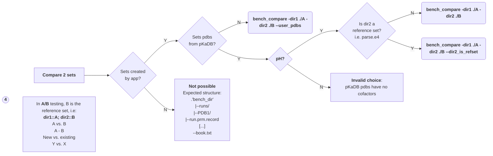

# MCCE_Benchmarking
_beta version_

# USER ROADMAP - 03-14-2024

## Four choices in MCCE_Benchmarking, `mcce_benchmark`:
### 1. Create a new benchmarking set (with a "launch right away" option)
### 2. Launch the automated runs for the set
### 3. Analyze one set of runs
### 4. Compare two sets of runs

#### All these correspond to command line "entry points", EPs, which the flowcharts below overview.
#### To learn about:
  * The options available for each EP/subcommands, see [Details](#Details)
  * The installation steps, see [Installation](#Installation)
  * Use cases & how-to, see [Tutorials](#Tutorials)

---

## Flowchart for the current entry points:

### EP `bench_setup +[user_pdbs or pkdb_pdbs sub-command]` handles the data & script setup:


### EP `bench_setup launch` is used if `--launch` was not used during data & script setup:


### EP `bench_analyze` does an "intra set" analysis; output folder: `-bench_dir` path/analysis:



### EP `bench_compare` does an "inter sets" analysis; output folder: `-o` value:


  * Note: The flag `--dir2_is_refset` indicates that 'dir2' is the _name_ of a packaged reference dataset, currently 'parse.e4' (pH titrations using the pKaDBv1 pdbs.); without it, dir2 is a path.


### Notes on processing:

In the flowcharts above, 'launch' means starting the batch-processing of the entire set (via creation of a crontab entry). 
In case there is a problem with the automated scheduling, the processing can still be done 'batch by batch' at the command line using the entry point for batching (which is what the crontab uses).  
After activating the conda env where MCCE_Benchmarking is installed, provide -job_name if your script setup was not default:
```
#  The batch size can be changed every time the cli is called:

(env) >bench_batch -bench_dir ./A -n_batch 15

# Monitor the state of processing via the 'bookkeeping' file:

(env) >cat ./A/runs/book.txt

# Repeat until the entire set is processed.

```

---

# Details

## Packaged `mcce_benchmark/data` folder contents
```
  ./
  ├── __init__.py
  ├── pkadbv1
  │   ├── WT_pkas.csv
  │   ├── metadata.md
  │   ├── proteins.tsv
  │   ├── runs/
  │   └── refsets/
  │       └── parse.e4/
  │           ├── analysis/
  │           └── runs/

```

## Experimental pKas data source
The original data comes from [Dr. Emil Axelov's pKa Database (1)](http://compbio.clemson.edu/lab/software/5/). The list for wild types and mutants alike was further curated by Dr. Junjun Mao at the Gunner Lab at CCNY to
mainly remove membrane proteins and those containing nucleotides, and to select the biological unit(s). The resulting file: `WT_pkas.csv` contains the primary data needed for benchmarking purpose.


#### pKa file header:
**'PDB ID', 'Res Name', 'Chain', 'Res ID', 'Expt. pKa', 'Expt. Uncertainty', '%SASA', 'Expt. method', 'Expt. salt conc','Expt. pH', 'Expt. temp', 'Reference'**

### File `proteins.tsv`:
Comments out the excluded pdbs and gives the reason. Column 'Model' identifies single- or multi- model structures.

### File `metadata.md`:
Experimental data source details; to be kept in data folder.

### Folder `runs`:
Holds the prepared pdb files, which reside inside a folder with the same pdbid in upper case.
```
	data/pkadbv1/runs/
	├── book.txt		# Q_BOOK in the code
	├── default_run.sh
	├── 135L
	...
	├── 9RAT
	└── 9RNT
```

#### Multi-model structures:
The original file was renamed with an appended `.full` extension, in case we need to redo the spliting.  
The split files are kept (named 'modelnn.pdb'), but now the pdb to be used as 'prot.pdb' matches the 'proteins.tsv'
'Use' column -> pdbid_use.pdb is the new name, with 'use' being the string from the 'Use' column minus the period.


## Command line interface (cli):
#### Description:
```
Launch a MCCE benchmarking job using either the curated structures from the pKaDBv1
or the user's pdbs list.

Entry points available at the command line:
 1. `bench_setup` along with one of 3 sub-commands:
  - Sub-command 1: 'pkdb_pdbs': setup data folders using the pdbs from pkadbv1 & the run script to run mcce steps 1 through 4;
  - Sub-command 2: 'user_pdbs': setup data folders using the pdbs provided via -pdbs_list option
  - Sub-command 3: 'launch': launch all the jobs via automated scheduling (crontab);

 2. `bench_batch` used to launch one batch of size n_batch
    Note: This is a convenience entry point that is used in the crontab (scheduler);

 3. `bench_analyze` along with one of 2 sub-commands:
  - Sub-command 1: 'pkdb_pdbs': analyze conformers and residues in user's 'benchmarks_dir'; get stats viz experiemntal pKas;
  - Sub-command 2: 'user_pdbs': analyze conformers and residues in user's 'benchmarks_dir';

 4. `bench_compare`: compare two sets of runs
    Options: -dir1, -dir2, -o, and two flags: --user_pdbs (absence means 'pkdb_pdbs'), --dir2_is_refset (to compare
             a set of runs with a packaged reference dataset, currently "parse.e4").

  (mce) >bench_compare -dir1 < d1> dir2 parse.e4 --dir2_is_refset -o ./output/dir/path	
```

#### Usage:

Examples for `bench_setup`: <+ 1 sub-command: pkdb_pdbs or user_pdbs or launch > <related args>\n
```

usage: bench_setup pkdb_pdbs [-h] -bench_dir BENCH_DIR [-n_pdbs N_PDBS] [-job_name JOB_NAME] [-sentinel_file SENTINEL_FILE]
                             [-wet WET] [--noter] [--s1_norun] [--s2_norun] [--s3_norun] [--s4_norun] [-d epsilon] 
                             [-conf_making_level CONF_MAKING_LEVEL] [-c start end] [-x /path/to/delphi] [-f tmp folder] 
                             [-p processes] [-r] [-titr_type ph or eh] [-i initial ph/eh]
                             [-interval interval] [-n steps] [--ms] [-e /path/to/mcce] [-u Key=Value] [--launch]

usage: bench_setup user_pdbs [-h] -bench_dir BENCH_DIR [-pdbs_list PDBS_LIST] [-job_name JOB_NAME] [-sentinel_file SENTINEL_FILE]
                             [-wet WET] [--noter] [--s1_norun] [--s2_norun] [--s3_norun] [--s4_norun] [-d epsilon]
                             [-conf_making_level CONF_MAKING_LEVEL] [-c start end] [-x /path/to/delphi] [-f tmp folder]
                             [-p processes] [-r] [-titr_type ph or eh] [-i initial ph/eh]
                             [-interval interval] [-n steps] [--ms] [-e /path/to/mcce] [-u Key=Value] [--launch]
```

1. pkdb_pdbs: Data & script setup using pkDBv1 pdbs:
   - Minimal input: value for -bench_dir option:
     ```
     >bench_setup pkdb_pdbs -bench_dir <folder path>
     ```
   - Using non-default option(s) (then job_name is required!):
     ```
     >bench_setup pkdb_pdbs -bench_dir <folder path> -d 8 -job_name <job_e8>
     ```

2. user_pdbs: Data & script setup using user's pdb list:
   - Minimal input: value for -bench_dir option, -pdb_list:
     ```
     >bench_setup user_pdbs -bench_dir <folder path> -pdb_list <path to dir with pdb files OR file listing pdbs paths>
     ```
   - Using non-default option(s) (then job_name is required! ):
     ```
     >bench_setup user_pdbs -bench_dir <folder path> -pdb_list <path> -d 8 -job_name <job_e8>
     ```

Sub-commands 1 & 2 have a flag: --launch, whose presence means the job scheduling & launch is done right away.
Do not use if you want to inspect/amend the run script.

3. launch: Launch runs via crontab schedule:
```
usage: bench_setup launch [-h] -bench_dir BENCH_DIR [-job_name JOB_NAME] [-n_batch N_BATCH] [-sentinel_file SENTINEL_FILE]

```
  - Minimal input: value for -bench_dir option: IFF no non-default job_name & sentinel_file were passed in 
    bench_setup [pkdb_pdbs, user_pdbs]
    ```
    >bench_setup launch -bench_dir <folder path>
    ```
  - Using non-default option(s):
    ```
    >bench_setup launch -bench_dir <folder path> -n_batch <jobs to maintain>
    ```
    Note: if changing the default sentinel_file="pk.out" to, e.g. step2_out.pdb,
          then the 'norun' script parameters for step 3 & 4 must be set accordingly:
          `>bench_setup launch -bench_dir <folder path> -sentinel_file step2_out.pdb --s3_norun --s4_norun`

4. Examples for `bench_analyze` (intra set analysis):
```
usage: bench_analyze pkdb_pdbs [-h] -bench_dir BENCH_DIR

usage: bench_analyze user_pdbs [-h] -bench_dir BENCH_DIR
```

5. Examples for `bench_compare` (inter sets analysis):
```
usage: bench_compare  [-h] -dir1 DIR1 -dir2 DIR2 [--user_pdbs | --dir2_is_refset] -o O
```

1. Without flag `--pkdb_pdbs` means the 2 sets were created with `user_pdbs`
```
>bench_compare -dir1 <path to set 1> -dir2 <path to set 2> -o <comp>
```

2. With flag `--pkdb_pdbs` means the 2 sets were created with `pkdb_pdbs`:
```
>bench_compare -dir1 <path to set 1> -dir2 <path to set 2> -o <comp>
```

3. With flag `--dir2_is_refset`: indicates that dir2 is a refset name; If used, `--pkdb_pdbs` must also be present.
```
>bench_compare -dir1 <d1> dir2 parse.e4 --pkdb_pdbs --dir2_is_refset -o <comp>
```

---

## Installation:

See [Installation](./Installation.md) for details.


## Tutorials:

See [Tutorials](./Tutorial.md) for use cases.
